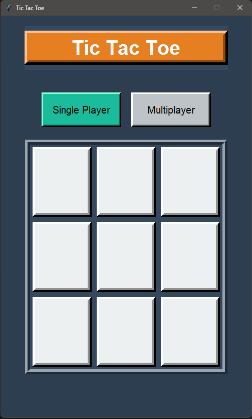

# 🎮 Tic Tac Toe

 

## 🌟 Overview

Welcome to the **Tic Tac Toe** game, a classic game brought to life with Python's Tkinter library! Play against a friend or challenge yourself with an AI opponent. Enjoy the game in a beautifully designed interface that centers on user experience!

## 🛠 Features

- **Single Player Mode**: Compete against a computer using the Minimax algorithm
- **Multiplayer Mode**: Play with a friend on the same device
- **Restart Functionality**: Easily restart the game at any time
- **Win Detection**: The game detects wins and draws with clear notifications
  
## 📥 Requirements
- Python 3.x
- Tkinter (included with standard Python installations)

## 🚀 How to Run

1. **Clone the repository** to your local machine:
```bash
git clone https://github.com/basharul2002/tic-tac-toe.git
```

2. Navigate to the project directory:
```bash
cd tic-tac-toe
```

3. Run the application:
```bash
python tic_tac_toe.py
```

## 📖 Code Explanation
- **Main Window:** The game window is centered on the screen and consists of frames for the title, game options, and the Tic Tac Toe board
- **Game Logic:** Utilizes a dictionary to manage the board state with functions to check for wins, draws, and to alternate player turns
- **Minimax Algorithm:** This algorithm empowers the AI with the ability to make optimal decisions in single-player mode


## 📄 License
This project is licensed under the **MIT License** - see the LICENSE file for details.

## 🙏 Acknowledgments
- Inspired by the classic Tic Tac Toe gameplay.
- Special thanks to the open-source community for providing invaluable guidance and resources.